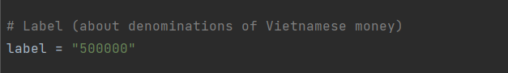
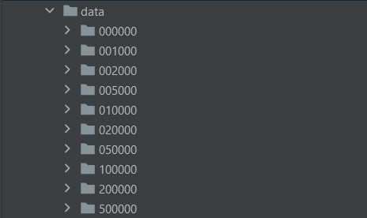
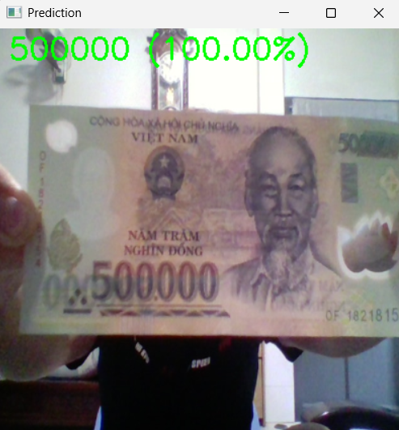
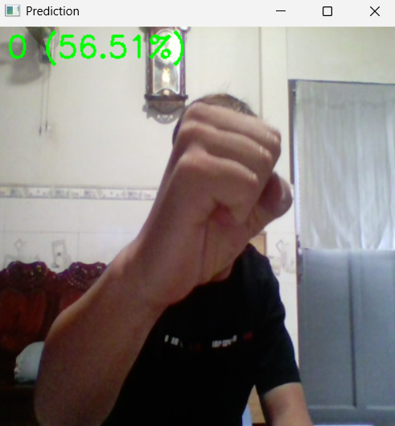
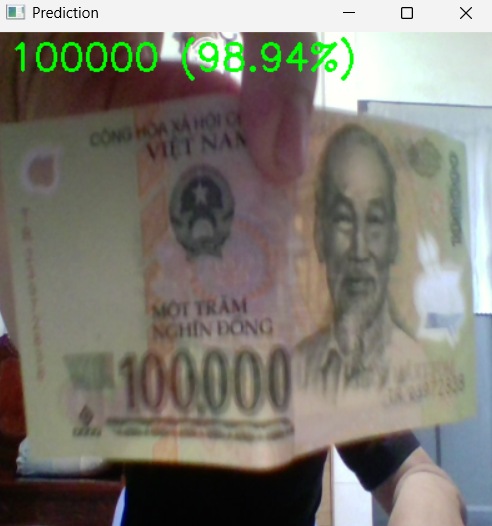
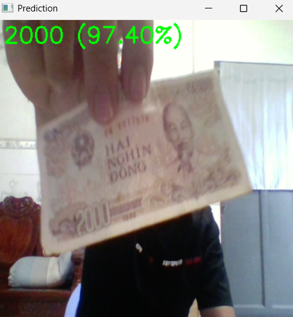
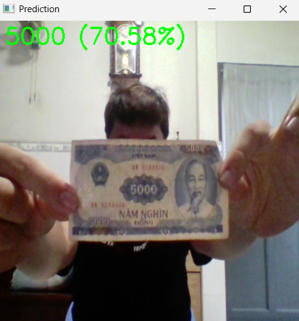
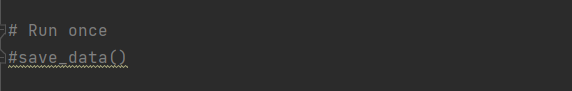
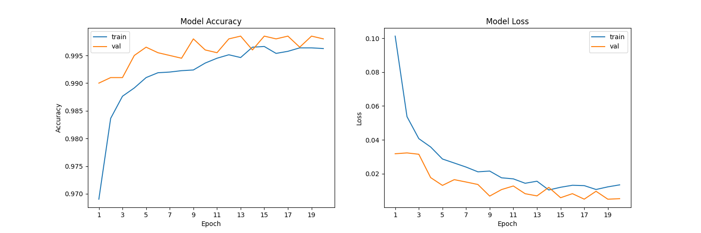

# Hệ Thống Nhận Diện, Phân Loại Và Dự Đoán Mệnh Giá Tiền Việt Nam

## I. Mô Tả Dữ Liệu & Cách Thu Thập
### Dữ Liệu Hình Ảnh Mệnh Giá Tiền Việt Nam Sẽ Được Thu Thập Bán Tự Động Dựa Vào Code Python Để Mở Camera Và Xử Lý Tác Vụ Thư Mục Còn Công Việc Của Người Thu Thập Chỉ Cần Thay Đổi Tên Thư Mục Với Mệnh Giá Tiền Tương Ứng Và Đưa Tờ Tiền Lên Trước Camera Để Hệ Thống Tự Động Thu Thập.
#### Tạo thư mục "data" -> Thay đổi tên "label" trong file "collect_data.py" theo mệnh giá tiền -> Chuẩn bị mệnh giá tiền đó đặt trước camera -> Chạy file "python collect_data.py" -> Bấm "q" để thoát sau khi thu thập xong:
#### Lưu ý: Mệnh giá tiền sẽ bao quát tất cả mệnh giá tiền và có cả 0 đồng, vì thế khi thu thập dữ liệu 0 đồng bạn chỉ cần đưa tay số 0 vào Camera là được.

#### Kết quả sau khi thu thập xong

## II. Kết Quả Đạt Được
### 1.

### 2.

### 3.

### 4.

### 5.

## III. Công Nghệ Sử Dụng Trong Dự Án
### 1. Ngôn ngữ chính: Python
### 2. Thu thập dữ liệu: OpenCV (cv2)
### 3. Xử lý dữ liệu: LabelBinarizer, preprocess_input (ResNet50)
### 4. Huấn luyện mô hình: ResNet50, ImageDataGenerator
### 5. Giao diện: OpenCv (cv2)

## IV. Cách Cài Đặt
### 1. Clone repo về máy "git clone https://github.com/akaichi21/Vietnamese_Money_Detection", "cd Vietnamese_Money_Detection"
### 2. Phần thu thập dữ liệu đã hướng dẫn ở trên
### 3. Cài đặt các thư viện cần thiết "pip install -r requirements.txt"
### 4. Phần "train_model.py" có một điểm cần lưu ý là hàm "save_data()" chỉ cần chạy 1 lần là đủ để tạo ra "pixels.data" đã được xử lý dữ liệu. Sau khi chạy xong thì nên đóng nó lại và chạy tiếp các phần khác để huấn luyện mô hình.

### 5. Huấn luyện mô hình "python train_model.py". Đây là phần kết quả sau khi huấn luyện của tôi.

### 6. Kiểm thử mô hình "python test_model.py". Kết quả tôi đã hiện thị ở trên.
